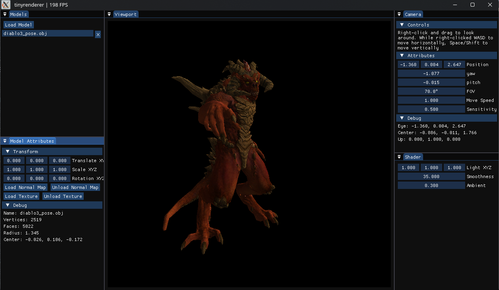
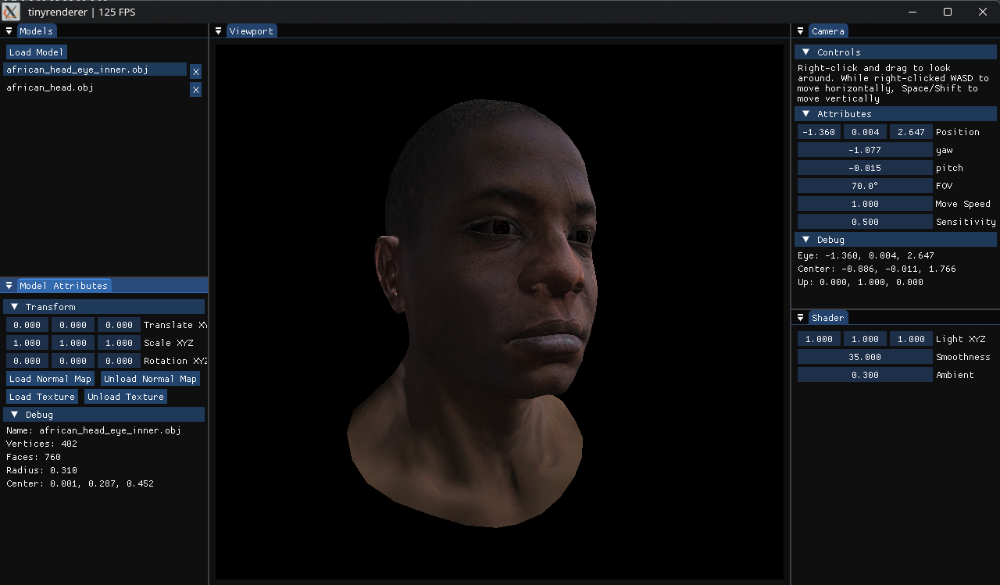

# Tinyrenderer
A real-time software renderer in C++ featuring interactive controls, parallel rasterization, and live scene manipulation. Built as an extension of ssloy's tinyrenderer course.

## Screenshots




## Building

### Linux & macOS
```bash
git clone https://github.com/aaronboch/tinyrenderer
cd tinyrenderer
cmake -B build/release && cmake --build build/release -j
```

Or use the Zed task (`build-project`) if you're editing in Zed.

Linux & macOS only. Untested on Windows.

### Dependencies
- CMake (used for building)
- raylib (used for window management and input handling)
- **Optional:** OpenMP (recommended for faster rendering)

## Usage 
```bash
./build/release/tinyrenderer
```

Or use the Zed task (`run-project`).

## Features
### From Course
- [x] Model loading
- [x] Rasterization
- [x] Phong reflection model 
  - [x] On faces
  - [x] On vertices
- [x] Normal mapping
  - [x] Tangent space normal mapping
- [x] Texture mapping

## Custom Features
- [x] Raylib instead of rendering out to one image.
- [x] Performance optimizations (to allow real time rendering)
  - [x] Parallel face loop instead of small part in rasterize function.
  - [x] General performance improvements
  - [x] Backface culling
  - [x] Object-level frustum culling
  - [x] Blinn-Phong reflection model
- [x] Camera controls
- [x] Loading Multiple Models 
  - [x] Support for multiple models in the same scene (e.g offsetting postion of each model, etc.)
- [x] ImGui to Control variables (e.g. Light direction, Roughness, etc.)
  - [x] Basic ImGui Setup
  - [x] Adding ability to load new models from ImGui 
  - [x] Adding controls for variables
    - [x] Model position/rotation/scale
    - [x] Shader properties (e.g. Light direction, Roughness, etc.)
    - [x] Camera position/rotation etc.

## License
MIT
